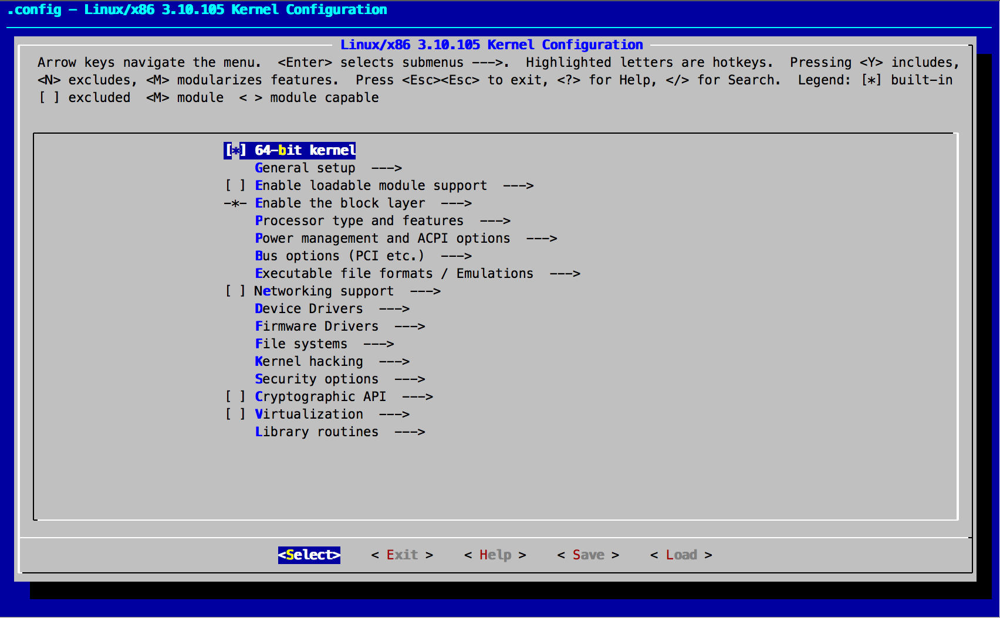
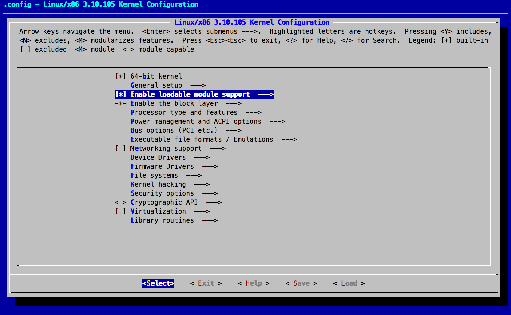
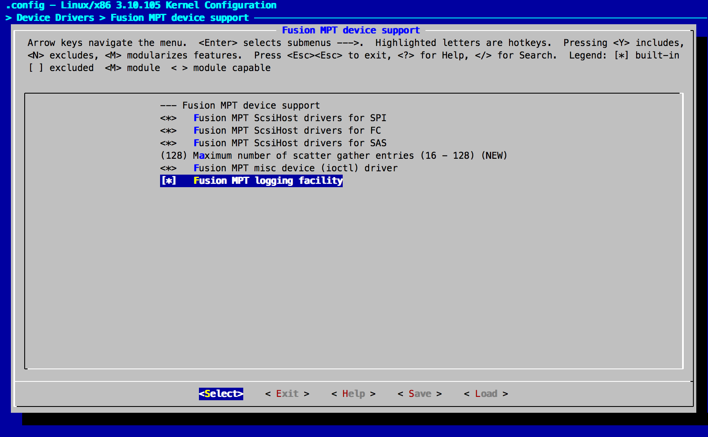
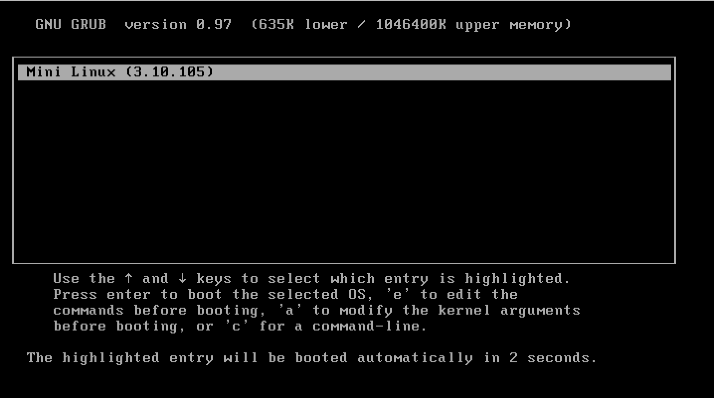
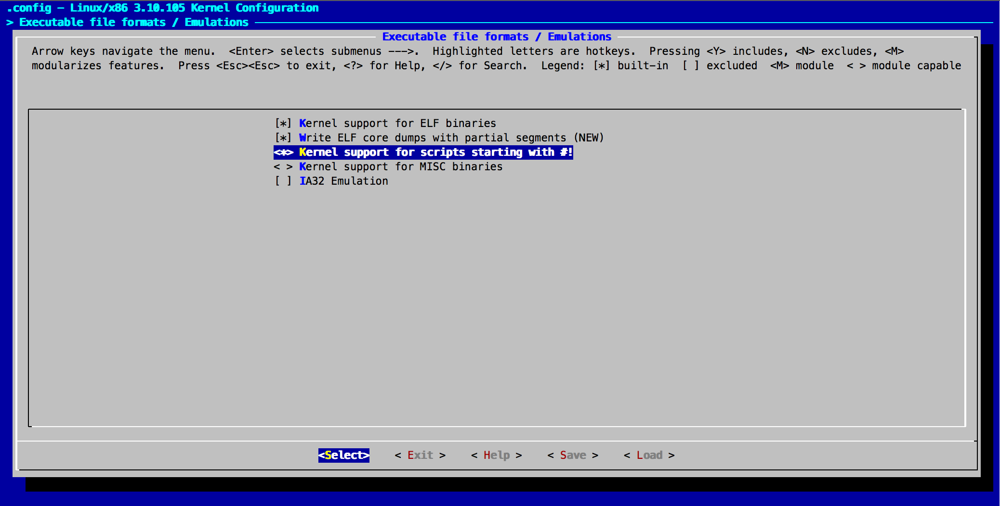

## mini Linux制作过程

    第 25 天 mini Linux制作过程（01）

### Mini Linux

- 启动流程：
    + CentOS 6:
    ```
        POST --> BostSequence(基于 BIOS 设定) --> BootLoader --> Kernel（ramdisk）--> rootfs --> /sbin/init

            编写服务脚本
            upstart配置文件

            /etc/init/*.conf
            /etc/inittab
                默认运行级别
                运行系统初始化脚本：/etc/rc.d/rc.sysinit
                /etc/rc.d/rc $runlevel
                启动终端，并运行login
                启动图形终端

        bootloader:
            lilo
            grub legacy
            grub2：
                stage1: mbr
                stage1_5: filesystem driver
                stage2: grub main program
    ```
    + CentOS 7:
    ```
        POST --> BostSequence(基于 BIOS 设定) --> BootLoader --> Kernel（ramdisk）--> rootfs --> /sbin/systemd

            编写服务脚本
            systemd unit 文件
    ```

- 内核编译：
    + make menuconfig --> .config
    + make [ -j # ]
    + make modules_install
    + make install

- 制作 mini Linux 步骤：
    + bootloader：grub
    + 内核：kernel (非模块方式)
    + 根文件系统：busybox

### 编译内核

- 安装开发环境：
```
    ~]# yum groupinstall "Development Tools" "Server Platform Development" -y
```

- 下载、解压、建立软连接内核源码
```
    1、下载
        ~]# wget http://140.206.33.170:8081/pub/kernel/linux-3.10.105.tar.xz
        or
        去内核官网(https://www.kernel.org)下载。
    2、解压至 /usr/src 目录下
         ~]# tar xf linux-3.10.105.tar.xz -C /usr/src
    3、建立连接
        ~]# cd /usr/src/
        src]# ln -sv linux-3.10.105  linux
        `linux' -> `linux-3.10.105'
```

- 查看硬件设备类型
```
    为了使内核轻量，我们只将需要的硬件设备驱动编译进内核，或者启动对相关硬件设备的支持。
    可以使用 lscpu、lspci 等命令获取当前系统的硬件信息。
```

- 编译内核
    + 创建内核配置模版文件
        * 将所有可选的配置全部禁用
        ```
        src]# cd linux
        linux]# make allnoconfig   
        ```
        * 图形化配置可选项
        ```
        linux]# make menuconfig    
        ```
        
            - 编译为 64 位内核
            
            - 启用加载模块支持
            
                + 支持模块动态装卸载
                
            - Processor type and features > Symmetric multi-processing support（使内核支持多核cpu功能）
            
            - Bus options (PCI etc.) > PCI support（开启支持PCI）
            
            - Device Drivers > SCSI device support（开启支持SCSI设备）
            
            - Device Drivers > SCSI device support > SCSI disk support（开启SCSI磁盘的支持）
            
            - Device Drivers > Fusion MPT device support > 一系列Fusion MPT驱动全部选择
            
    + 编译
    ```
        linux] make -j 4 bzImage //编译为bz2压缩格式的image，默认存储为 arch/x86/boot/bzImage
    ```

- 给当前的虚拟机（CentOS 6）添加一块新的硬盘，此硬盘作为 Mini Linux 内核的安装

    + 分区：
    ```
        [root@node1 ~]# fdisk /dev/sdb 
        Device contains neither a valid DOS partition table, nor Sun, SGI or OSF disklabel
        Building a new DOS disklabel with disk identifier 0x9e1fcfba.
        Changes will remain in memory only, until you decide to write them.
        After that, of course, the previous content won't be recoverable.

        Warning: invalid flag 0x0000 of partition table 4 will be corrected by w(rite)

        WARNING: DOS-compatible mode is deprecated. It's strongly recommended to
                 switch off the mode (command 'c') and change display units to
                 sectors (command 'u').

        Command (m for help): n
        Command action
           e   extended
           p   primary partition (1-4)
        p
        Partition number (1-4): 1
        First cylinder (1-2610, default 1): 
        Using default value 1
        Last cylinder, +cylinders or +size{K,M,G} (1-2610, default 2610): +100M

        Command (m for help): n
        Command action
           e   extended
           p   primary partition (1-4)
        p
        Partition number (1-4): 2
        First cylinder (15-2610, default 15): 
        Using default value 15
        Last cylinder, +cylinders or +size{K,M,G} (15-2610, default 2610): +2G

        Command (m for help): p

        Disk /dev/sdb: 21.5 GB, 21474836480 bytes
        255 heads, 63 sectors/track, 2610 cylinders
        Units = cylinders of 16065 * 512 = 8225280 bytes
        Sector size (logical/physical): 512 bytes / 512 bytes
        I/O size (minimum/optimal): 512 bytes / 512 bytes
        Disk identifier: 0x9e1fcfba

           Device Boot      Start         End      Blocks   Id  System
        /dev/sdb1               1          14      112423+  83  Linux
        /dev/sdb2              15         276     2104515   83  Linux

        Command (m for help): w
        The partition table has been altered!

        Calling ioctl() to re-read partition table.
        Syncing disks.
    ```
    + 格式化：
    ```
        ~]# mke2fs -t ext4 /dev/sdb1
        ~]# mke2fs -t ext4 /dev/sdb2
    ```
    + 挂载：
    ```
        ~]# mkdir /mnt/{boot,sysroot}
        ~]# mount /dev/sdb1 /mnt/boot/    // 此作为 Mini Linux 的 boot 分区
        ~]# mount /dev/sdb2 /mnt/sysroot/
    ```

- 安装`grub`到`/mnt/boot/`目录:
```
    ~]# grub-install --root-directory=/mnt /dev/sdb
```

- 复制内核到 boot 目录：
```
    ~]# cp  /usr/src/linux/arch/x86/boot/bzImage /mnt/boot/bzImage
    ~]# file /mnt/boot/bzImage
    /mnt/boot/bzImage: Linux kernel x86 boot executable bzImage, version 3.10.105 (root@node1.centos.cn), RO-rootFS, swap_dev 0x1, Normal VGA
```

- 配置`grub.conf`文件：
```
    ~]# vim /mnt/boot/grub/grub.conf
    default=0
    timeout=3
    title Mini Linux (3.10.105)
            root (hd0,0)
            kernel /bzImage ro root=/dev/sda2
```

至此编译内核已经完成，并新增加了一块硬盘，新的硬盘作为 Mini Linux 的系统安装盘，为其创建了 `/boot` 和 `/` 两个分区，然后为 `/boot` 分区安装了 `grub`，最后将新编译的内核镜像文件复制至 `/boot` 分区，并为 `grub` 编写了 `grub.conf` 配置文件，使其能够使用新编译的内核镜像。

下面将 node1 **挂起**，并创建 Mini Linux 虚拟机，并使用上述配置的硬盘作为系统盘。

启动 Mini Linux，`grub` 已能正常运行，并提示使用的内核文件：



因编译内核是没有启用对文件系统的驱动，所以这里会显示根文件系统无法挂载，内核恐慌（kernel panic）：


- 重新编译内核，将文件系统驱动增加进去：

    将 Mini Linux 关闭，开启 node1 后，重新编译内核。
    ```
        ~]# cd /usr/src/linux
        linux]# make menuconfig
    ```

    + File systemx > 需要支持的文件系统
    

    + Executable file formats / Emulations > 开启内核可执行文件的格式（ELF 和以 #! 开头的 shell 脚本）
    

- 重新编译，并将 `bzImage` 文件复制至 `/mnt/boot/` 目录
```
    linux]# make -j 4 bzImage 
    ~]# cp arch/x86/boot/bzImage /mnt/boot/
    cp: overwrite `/mnt/boot/bzImage'? y
```

- 此时，将 node1 挂起，再次启动 Mini Linux，其因为没有 `init` 程序，导致内核再次恐慌：


- 源码中定义的内核启动后执行的命令：
```
    ~]# vim /usr/src/linux/init/main.c
    841         if (execute_command) {
    842                 if (!run_init_process(execute_command))
    843                         return 0;
    844                 pr_err("Failed to execute %s.  Attempting defaults...\n",
    845                         execute_command);
    846         }
    847         if (!run_init_process("/sbin/init") ||
    848             !run_init_process("/etc/init") ||
    849             !run_init_process("/bin/init") ||
    850             !run_init_process("/bin/sh"))
    851                 return 0;
```

- 移植一个 `bash` 至 Mini Linux：
    + 手动创建一个跟文件系统：
    ```
        ~]# cd /mnt/sysroot/
        sysroot]# mkdir -pv etc dev proc sys bin sbin usr/{bin,sbin,lib,lib64} lib64 lib/modules home var/{log,run,lock} tmp mnt media root boot
    ```
    + 复制当前系统的 `bash`
    ```
    复制程序及其依赖的库文件脚本示例：
    ~]# cat bincp.sh 
    #!/bin/bash
    #
    target=/mnt/sysroot
    [ -d $target ] || mkdir $target

    read -p "A command: " command

    libcp() {
            for lib in $(ldd $1 | grep -o "[^[:space:]]*/lib[^[:space:]]*"); do
                    libdir=$(dirname $lib)
                    [ -d $target$libdir ] || mkdir -p $target$libdir
                    [ -f $target$lib ] || cp $lib $target$lib
            done
    }

    while [ "$command" != 'quit' ]; do
            if ! which $command &> /dev/null; then
                    read -p "No such command, enter again:" command
                    continue
            fi
            command=$(which --skip-alias $command)
            cmnddir=$(dirname $command)

            [ -d $target$cmnddir ] || mkdir -p $target$cmnddir
            [ -f $target$command ] || cp $command $target$command
            libcp $command
            read -p "Another command(quit):" command
    done

    ~]# bash bincp.sh 
    A command: bash
    Another command(quit):ls
    Another command(quit):quit
    ~]#
    ```

- 修改 `grub.conf` 文件，指定其 `init` 运行 `/bin/bash`：
```
    ~]# vim /mnt/boot/grub/grub.conf
    default=0
    timeout=3
    title Mini Linux (3.10.105)
            root (hd0,0)
            kernel /bzImage ro root=/dev/sda2 init=/bin/bash
```

- 将 node1 挂起，再次启动 Mini Linux，显示已经启动 `bash`：


此时还无法对 Mini Linux 输入任何内容，因为编译内核时，没有启用键盘驱动。

- 重新编译内核，加入键盘及鼠标的驱动：

Ps: VMware 模拟的鼠标是 usb 接口的鼠标，如若使内核支持鼠标，需先在 `Device Driver` 中启用 usb 驱动，可以使用 `lsusb` 命令查看虚拟机使用 usb 类型。

- 再次复制内核镜像文件至 `/mnt/boot` 目录后，挂起 node1，启动 Mini Linux：


此时，内核成功启动完成。

- 给 Mini Linux 仿造一个 init 脚本文件，以供其启动时自动启动：
```
    ~]# cd /mnt/sysroot/
    sysroot]# vim sbin/init
    #!/bin/bash
    #
    echo -e "\tWelcome to \033[32mMini\033[0m Linux"
    mount -n -t proc proc /proc
    mount -n -t sysfs sysfs /sys
    mount -n -o remount,rw /dev/sda2 /
    /bin/bash
    sysroot]# chmod +x sbin/init

    删除 grub.conf 中的 init 设置，使其使用默认值会自动执行 /sbin/init 文件：
        ~]# vim /mnt/boot/grub/grub.conf
        default=0
        timeout=3
        title Mini Linux (3.10.105)
                root (hd0,0)
                kernel /bzImage ro root=/dev/sda2 

    ~]# bash bincp.sh 
    A command: mount
    Another command(quit):blkid
    Another command(quit):touch
    Another command(quit):quit
```

此时如果重新启动 Mini Linux，其 `/dev/` 目录下没有任何设备文件，需要内核支持，内核会对识别的设备自动在 `/dev/` 目录下创建设备文件。

- 内核启用支持自动在 `/dev/` 自动创建设备文件：


- 编译 --> 复制内核文件至 `/mnt/boot` --> 挂起 node1，启动 Mini Linux：


其执行了 `init` 文件，挂载了相应的设备，内核并在 `/dev/` 目录下输出了识别的设备的设备文件。

        第 25 天 mini Linux制作过程（02）

### Mini Linux：kernel + busybox

- busybox

[BusyBox](https://www.busybox.net) 是一个集成了一百多个最常用 Linux 命令和工具（如 cat、echo、grep、mount、telnet 等）的精简工具箱，它只需要几 MB 的大小，很方便进行各种快速验证，被誉为“Linux 系统的瑞士军刀”。

BusyBox 可运行于多款 POSIX 环境的操作系统中，如 Linux（包括 Android）、Hurd、FreeBSD 等。

- 安装 busybox
    + 安装 `glibc-static`，`make` 命令静态编译时依赖此库。
    ```
        ~]# yum install glibc-static -y
    ```
    + [下载](http://busybox.net/downloads/busybox-1.28.1.tar.bz2)：
    ```
        ~]# wget http://busybox.net/downloads/busybox-1.28.1.tar.bz2
        ~]# tar xf busybox-1.28.1.tar.bz2 
    ```
    + 创建 `.config` 文件：
        ```
            ~]# cd busybox-1.28.1
            busybox-1.28.1]# make menuconfig
        ```
        

        * Settings > Build static binary (no shared libs) 不使用共享库编译：
            
    + 编译：
    ```
        busybox-1.28.1]# make && make install   // 默认将安装在 _install/ 目录下

        编译完成，默认安装在 _install 目录下。

        错误处理：
            https://zhuanlan.zhihu.com/p/27387327
    ```
    + 将编译好的 busybox 复制到 /mnt/sysroot 目录下，作为 Mini Linux 操作系统
    ```
        [root@node1 ~]# cd /mnt/sysroot/
        [root@node1 sysroot]# rm -rf ./*
        [root@node1 sysroot]# cd /usr/local/src/busybox-1.28.1
        [root@node1 busybox-1.28.1]# cp -a _install/* /mnt/sysroot/
        [root@node1 busybox-1.28.1]# chroot /mnt/sysroot/ /bin/ash
        / # ls
        bin      linuxrc  sbin     usr
        / # 
        [root@node1 ~]# cd /mnt/sysroot/
        [root@node1 sysroot]# mkdir -pv etc lib lib64 proc sys dev root home boot mnt media tmp var
    ```

- 启用内核支持网络及网卡设备
    + Networking support > Networking optons > TCP/IP networking (开启内核支持 TCP/IP 网络)
        
    + Device Drivers > Network device support > Ethernet driver support (网卡驱动)
        
    + 再次复制内核镜像文件至 `/mnt/boot` 目录后，挂起 node1，启动 Mini Linux，网卡已存在：
        

- 编译单个内核模块：
``` 
    # cd /usr/src/linux
    # make M=drivers/net/ethernet/intel/e1000/

    # mkdir -pv /mnt/sysroot/lib/modules 
    # cp dirvers/net/ethernet/inter/e1000/e1000.ko /mnt/sysroot/lib/modules/

    / # insmod /lib/modules/e1000.ko  // busybox 下手动装载内核模块

    # make M=path/to/somedir/
```

- 提供主机名：
```
    sysroot]# mkdir etc/sysconfig
    sysroot]# vim etc/sysconfig/network
    HOSTNANE=minilinux.magedu.com
```

- 登录认证：
```
    创建相关文件：
        [root@node1 ~]# head -1 /etc/passwd > /mnt/sysroot/etc/passwd
        [root@node1 ~]# head -1 /etc/group > /mnt/sysroot/etc/group
        [root@node1 ~]# head -1 /etc/shadow > /mnt/sysroot/etc/shadow
        [root@node1 sysroot]# chmod 400 etc/shadow 

    生成 md5 密码指纹替换掉 shdow 文件中 sha512 密码指纹
        [root@node1 ~]# openssl passwd -1 -salt $(openssl rand -hex 4) 
        Password: 
        $1$1d491dfd$sBbpkODardd5uJie170s/0
        [root@node1 ~]# vim /mnt/sysroot/etc/shadow
        root:$1$1d491dfd$sBbpkODardd5uJie170s/0:17457:0:99999:7:::

    移植 bash
        [root@node1 ~]# bash bincp.sh 
        A command: bash
        Another command(quit):quit
```
- 编写 `fstab`、`inittab` 配置文件 及初始化脚本:
```
    ~]# cd /mnt/sysroot/
    sysroot]# vim etc/fstab
    sysfs           /sys    sysfs   defaults        0 0
    proc            /proc   proc    defaults        0 0
    /dev/sda1       /boot   ext4    defaults        0 0
    /dev/sda2       /       ext4    defaults        0 0

    sysroot]# vim etc/inittab
    ::sysinit:/etc/rc.d/rc.sysinit
    ::respawn:/sbin/getty 9600 tty1      // getty 自动调用longin程序，并打印等了提示符
    ::respawn:/sbin/getty 9600 tty2
    ::respawn:/sbin/getty 9600 tty3
    ::ctrlaltdel:/sbin/reboot
    ::shutdown:/bin/umount -a -r

    sysroot]# mkdir etc/rc.d
    sysroot]# vim etc/rc.d/rc.sysinit
    #!/bin/sh
    #
    echo -e "\tWelcome to \033[32mMini\033[0m Linux"
    mount -t proc proc /proc
    mount -t sysfs sysfs /sys

    echo "scan /sys and to populate to /dev..."
    mdev -s

    mount -o remount,rw /dev/sda2 /
    mkdir /dev/pts
    mount -t devpts devpts /dev/pts

    echo "mounting all filesystems..."
    mount -a

    echo "Load driver for e1000..."
    insmod /lib/modules/e1000.ko

    echo "Initializing ethernet card..."
    ifconfig eth0 192.168.1.200 up
    ifconfig lo 127.0.0.1 up

    [ -f /etc/sysconfig/network ] && . /etc/sysconfig/network
    [ -z "$HOSTNAME" -o "$HOSTNAME" == '(none)' ] && HOSTNAME='localhost'
    hostname $HOSTNAME

    sysroot]# chmod +x etc/rc.d/rc.sysinit
```

- 提供 issue 文件：
```
    ~]# cd /mnt/sysroot/
    sysroot]# vim etc/issue
    Welcome to MageEdu Linux(http://www.magedu.com)
    Kernel \r

```

- 安装 dropbear 到 Mini Linux：
```
    下载，解压：
        # wget http://140.206.33.170:8081/pub/kernel/dropbear-2016.74.tar.bz2
        # tar xf dropbear-2016.74.tar.bz2 
        # cd dropbear-2016.74

    编译，安装：
        # ./config  
        # make && make install
        默认安装在 /usr/local 目录下。

    移植到 Mini Linux：
        [root@node1 ~]# bash bincp.sh 
        A command: dropbear
        Another command(quit):dropbearkey
        Another command(quit):dbclient
        Another command(quit):quit

    为 dropbear 生成密钥文件：
        [root@node1 sysroot]# mkdir etc/dropbear
        [root@node1 sysroot]# cd etc/dropbear
        [root@node1 dropbear]# dropbearkey -t rsa -s 2048 -f dropbear_rsa_host_key
        Generating key, this may take a while...
        Public key portion is:
        ssh-rsa AAAAB3NzaC1yc2EAAAADAQABAAABAQCet6s8XmZOlVTzG2RomrMLo1X/89j+esCmzdbcyhhFF76Cj+1FGcBguZ6WoJxlApFQzlCdomkWtNFGIM6/pbXIuvrDdcDGZlpXpKmq2uBz6WNyB8eqM+zNyOLNr+Y8XpSfD3NrbTzB6weSlDIjA7m6REdJSGWKEEmdyzvFH3djcdRrV1PzHQwB2rRCgNo1l/5wapK/++51V+8ptP0wpoh2CTEbjNYnCRrEoeeU6THBYuXKmuUk/0OgBMucg7L7qaITLuxKt6R77zko0+3SvlYTu8jDLFre5jYdgyWOLGIvQKrAVpPHuraKOEfln2OAic4uhYLBlYn1klLDdwI9MrND root@node1.centos.cn
        Fingerprint: md5 3e:72:1f:32:4b:14:74:e3:8e:35:7c:3a:d3:6b:35:9d
        [root@node1 dropbear]# dropbearkey -t dss -f dropbear_dss_host_key           
        Generating key, this may take a while...
        Public key portion is:
        ssh-dss AAAAB3NzaC1kc3MAAACBAIFa09VIcFJMvxqjfGPelZLBbwmmVxRYkcd8D6JaUXdolzqV+ucf+hpRKlmWZcaaPioKaLeTxgKuKMP3nkv9UXSDyjiEYgZBVNo4TEHc8KxG0pSHZ6yFIDXdeIvTsTJl2doISEv8NuGR8aLy9sLowtkV5S0yQ5N4CL+ZgRcL21gjAAAAFQDcwxaJ5cn5PJokmWTaGw2SGsQpuQAAAIAlNSL6UU17fg+9D7qFpEZh7TWosxVzmPau1et79s4oT7DrSwLjt0ByF2yj3hbw9hrTsNV5ypbTSBsIAhJS6p2g+mtRyZQTJdUN0olNI2wQ8shNRU8pxVTmsEP6XKOF3C/9QdKG2Q8Y+vU1VTXhL7lrm+F+C1ePyna+9WqDpzFlZAAAAIBV6wuBWvBbBVk2x5WWa5oOUT10IYJ1yf6/gk1N/PhLT0EhzvU6jmdgP4nzgMbWRgzL7YPh6Xai0ypQbAzdvH05ka0z+zVqMuhc0fMPxS2W5aYesZlGHnRUUmnlxbojCfT/L2cVs1uNFr026Yk4E4Z6OWT+ynYQ71ji3qbvEw3gtw== root@node1.centos.cn
        Fingerprint: md5 16:5a:1e:d2:11:44:93:85:32:23:00:18:a0:14:6e:d0
        [root@node1 dropbear]# ll
        total 8
        -rw-------. 1 root root 457 Mar  5 10:30 dropbear_dss_host_key
        -rw-------. 1 root root 805 Mar  5 10:30 dropbear_rsa_host_key

    创建伪终端目录，并修改 fstab 文件增加伪文件系统自动挂载：
        [root@node1 ~]# cd /mnt/sysroot/
        [root@node1 sysroot]# mkdir dev/pts

        [root@node1 sysroot]# vim etc/fstab 
        sysfs           /sys    sysfs   defaults        0 0
        proc            /proc   proc    defaults        0 0
        devpts          /dev/pts        devpts  mode=620        0 0
        /dev/sda1       /boot   ext4    defaults        0 0
        /dev/sda2       /       ext4    defaults        0 0

    配置 shells 文件，dropbear 认为此文件中指定的 shell 是安全的 shell：
        sysroot]# vim etc/shells
        /bin/sh
        /bin/ash
        /bin/hush
        /bin/bash
        /sbin/nologin

    配置 nsswitch (网络服务转换)：
        配置文件：
            sysroot]# vim etc/nsswitch.conf
            passwd: files
            group: files
            shadow: files
            hosts: files dns
        复制库文件：
            sysroot]# mkdir  usr/lib64
            sysroot]# cp -d /lib64/libnss_files* lib64/
            sysroot]# cp -d /usr/lib64/libnss3.so usr/lib64/ 
            sysroot]# cp -d /usr/lib64/libnssutil3.so usr/lib64/
            sysroot]# cp -d /usr/lib64/libnss_files* usr/lib64/
```

- **关机** node1，启动 Mini Linux：
```
    此时第一个终端有问题，输入密码后卡死，control + alt + F2 切换到第二个终端使用。
```


- `PS1` `PATH`
```
    -bash-4.1 # vi .bash_profile
    export PS1='[\u@\h \w]\$'
    exprot PATH=$PATH:/usr/local/bin:/usr/local/sbin
```

- 启动 dropbear
```
    创建 /var/run 目录，dropbear pid 文件目录：
        # mkdri /var/run
    启动 dropbear 
        # dropbear -F -E
        not backgrounding

    ctrl + alt + F3 切换至另一终端查看是否监听了 22 号端口：
        # netstat -tnl
```

(完)
        
